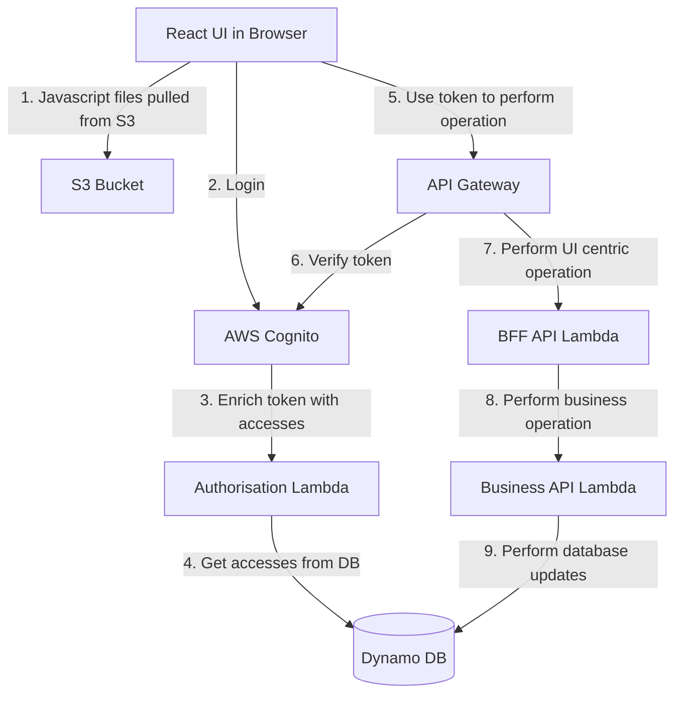

```mermaid
graph TD;
    UI[React UI in Browser]
    S3[S3 Bucket]
    Cognito[AWS Cognito]
    Gateway[API Gateway]
    Authorisation[Authorisation Lambda]
    BFF[BFF API Lambda]
    BAPI[Business API Lambda]
    DB[(Dynamo DB)]

    UI-->|1. Javascript files pulled from S3|S3
    UI-->|2. Login|Cognito
    Cognito-->|3. Enrich token with accesses|Authorisation
    Authorisation-->|4. Get accesses from DB|DB
    UI-->|5. Use token to perform operation|Gateway
    Gateway-->|6. Verify token|Cognito
    Gateway-->|7. Perform UI centric operation|BFF
    BFF-->|8. Perform business operation|BAPI
    BAPI-->|9. Perform database updates|DB
```