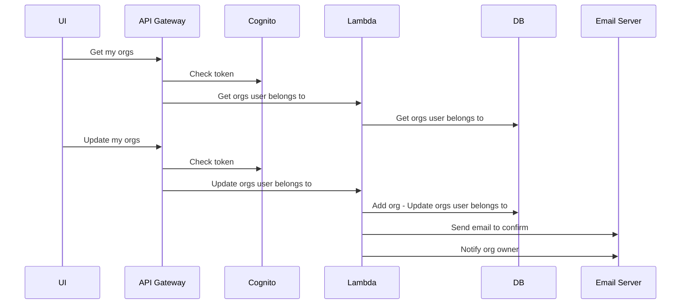
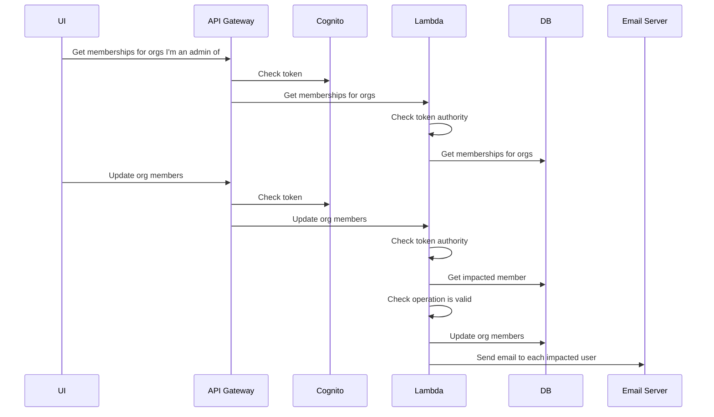

# Manage My Memberships
* Can remove self from orgs so that user is no longer a member
* Can confirm or delete invitations to Orgs
* Can create a new org - user will be admin

# Manage Organisation
* Must be an admin of the org
* Can send an invitation to a user to be a part of an organisation
* Can assign or unassign admin role to existing confirmed members
  * There must always be at least one admin
  * Can remove self as admin
* Can remove a member from an organisation
* Can delete an organisation

