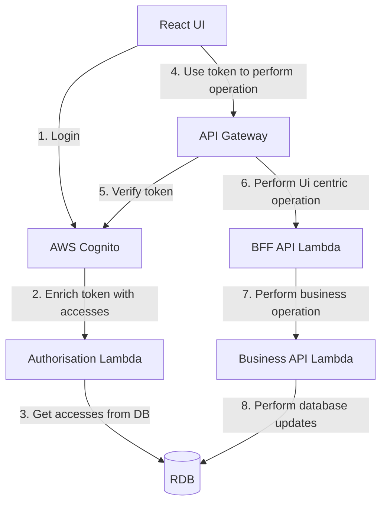

```mermaid
graph TD;
    UI[React UI]
    Cognito[AWS Cognito]
    Gateway[API Gateway]
    Authorisation[Authorisation Lambda]
    BFF[BFF API Lambda]
    BAPI[Business API Lambda]
    DB[(RDB)]

    UI-->|1. Login|Cognito
    Cognito-->|2. Enrich token with accesses|Authorisation
    Authorisation-->|3. Get accesses from DB|DB
    UI-->|4. Use token to perform operation|Gateway
    Gateway-->|5. Verify token|Cognito
    Gateway-->|6. Perform Ui centric operation|BFF
    BFF-->|7. Perform business operation|BAPI
    BAPI-->|8. Perform database updates|DB
```