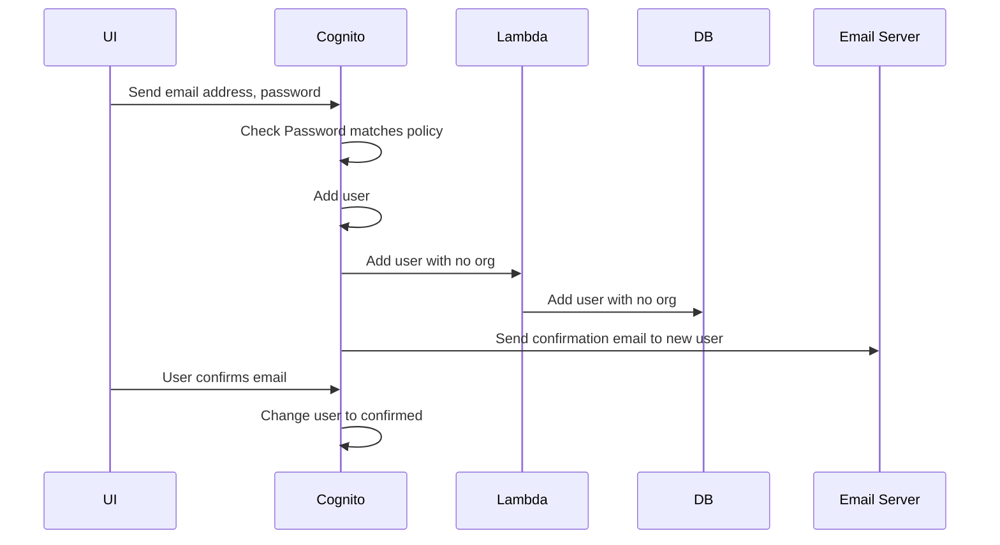
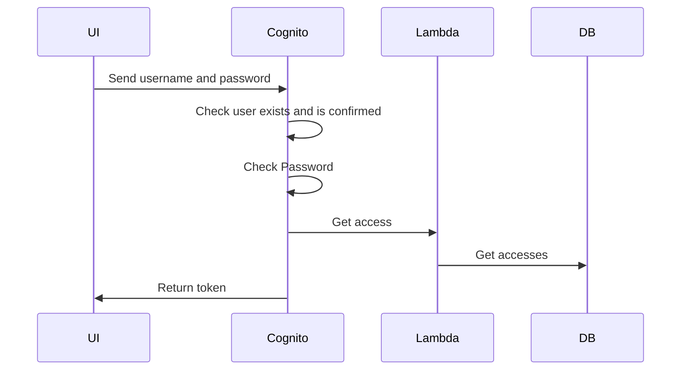
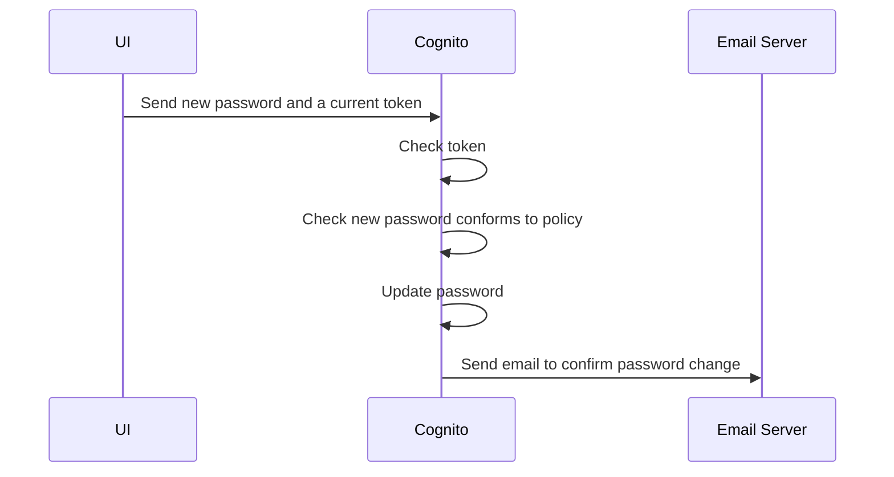
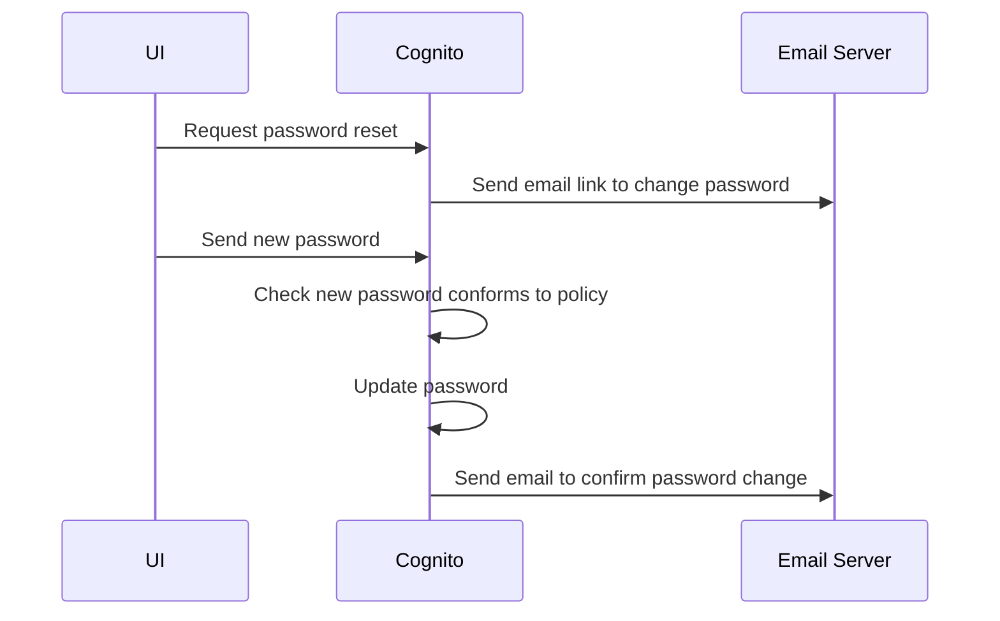
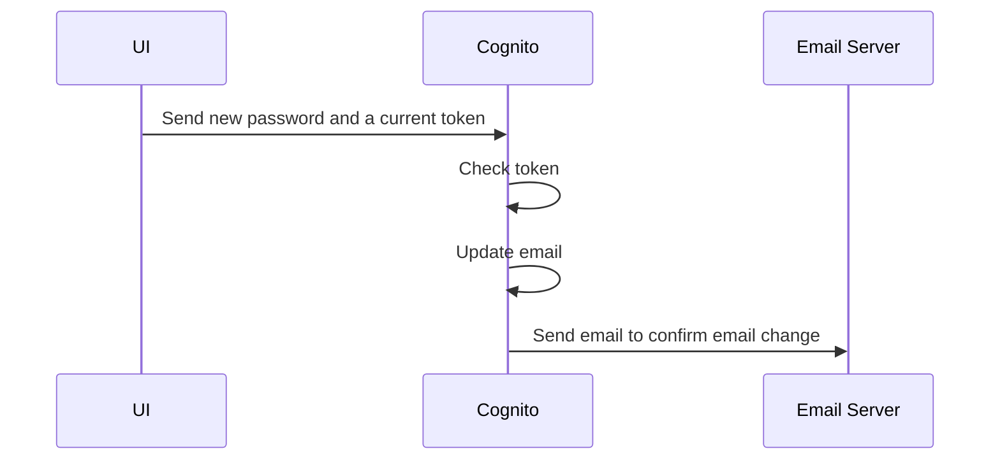

# Register

```mermaid
sequenceDiagram
    participant UI
    participant Cognito
    participant Lambda
    participant DB
    participant Email Server


    UI->>Cognito: Send email address, password
    Cognito->>Cognito: Check Password matches policy
    Cognito->>Cognito: Add user
    Cognito->>Lambda: Add user with no org
    Lambda->>DB: Add user with no org
    Cognito->>Email Server: Send confirmation email to new user
    UI->>Cognito: User confirms email
    Cognito->>Cognito: Change user to confirmed
```

# Login

```mermaid
sequenceDiagram
    participant UI
    participant Cognito
    participant Lambda
    participant DB


    UI->>Cognito: Send username and password
    Cognito->>Cognito: Check user exists and is confirmed
    Cognito->>Cognito: Check Password
    Cognito->>Lambda: Get access
    Lambda->>DB: Get accesses
    Cognito->>UI: Return token
```

# Change Password

```mermaid
sequenceDiagram
    participant UI
    participant Cognito
    participant Email Server

    UI->>Cognito: Send new password and a current token
    Cognito->>Cognito: Check token
    Cognito->>Cognito: Check new password conforms to policy
    Cognito->>Cognito: Update password
    Cognito->>Email Server: Send email to confirm password change
```

# Reset Password

```mermaid
sequenceDiagram
    participant UI
    participant Cognito
    participant Email Server

    UI->>Cognito: Request password reset
    Cognito->>Email Server: Send email link to change password
    UI->>Cognito: Send new password
    Cognito->>Cognito: Check new password conforms to policy
    Cognito->>Cognito: Update password
    Cognito->>Email Server: Send email to confirm password change
```
# Update Email Address

```mermaid
sequenceDiagram
    participant UI
    participant Cognito
    participant Email Server

    UI->>Cognito: Send new password and a current token
    Cognito->>Cognito: Check token
    Cognito->>Cognito: Update email
    Cognito->>Email Server: Send email to confirm email change
```

